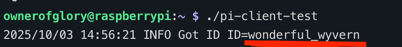

# Go + Pion (WebRTC) on Raspberry Pi PoC

It's a PoC [WebRTC](https://webrtc.org/) client for [Raspberry Pi](https://www.raspberrypi.com/), built with [Pion](https://pion.ly/) ([GitHub Repo](https://github.com/pion/webrtc))
and [GStreamer](https://gstreamer.freedesktop.org/).
It connects to a signaling server, streams camera/microphone over WebRTC, and supports data channels for testing peer connections


## Prerequisites

I tested it on a **Raspberry Pi model 4B** (1GB RAM, 1,4 GHz ARM Cortex-A53 Quad-Core-CPU) but
I guess it can easily run on a smaller model like **Raspberry Pi Zero** or **Raspberry Pi Zero 2 W**

- `Gstreamer` installed on Raspberry Pi
- (Optional) `Go` installed, otherwise cross-compile the program for raspi
- Camera [and microphone if needed], connected to raspi
- Signaling server or any other mean to exchange the SPD messages and ICE-candidates
- Set the env var, e.g:
```shell
  export SIGNAL_WS_URL=wss://your.host/webrtc-signaling/ws
  export SIGNAL_ORIGIN=https://your.host # (must match AllowedOrigins)
  export RTC_CONFIG_URL=https://your.host/webrtc-signaling/api/rtc-config
  
  #  optional:
  # export VIDEO_PORT=5004
  # export AUDIO_PORT=5006
  # export GST_VIDEO_PIPELINE='libcamerasrc ! video/x-raw,width=640,height=480,framerate=30/1 ! videoconvert ! x264enc tune=zerolatency bitrate=500 speed-preset=ultrafast key-int-max=60 ! h264parse config-interval=1 ! rtph264pay pt=96 config-interval=1 ! udpsink host=127.0.0.1 port=5004'
  # export GST_AUDIO_PIPELINE='alsasrc ! audioconvert ! audioresample ! opusenc bitrate=24000 ! rtpopuspay pt=111 ! udpsink host=127.0.0.1 port=5006'
```

I used my own ["playground" signaling server](https://github.com/ownerofglory/webrtc-signaling-go) on websockets


##  Run
### Download the binary
```shell
wget https://github.com/ownerofglory/go-pion-raspi-poc/releases/download/v1.0.0/pi-client-arm64.zip
unzip pi-client-arm64.zip
```

**OR** 

### [Cross-]compile for Raspi
```shell
make
```
### Drop the program into your raspi

```shell
scp ./build/pi-client-arm64 <user>@<raspberry_host>:~
```

### Run on Raspi
Once the env variable set:
```shell
./pi-client-arm64
```

**OR**
Set the env variables inline
```shell
SIGNAL_WS_URL=wss://your.host/webrtc-signaling/ws \
SIGNAL_ORIGIN=https://your.host \
RTC_CONFIG_URL=https://your.host/webrtc-signaling/api/rtc-config \
./pi-client-arm64
```

## Example running with my  ["playground" signaling server](https://github.com/ownerofglory/webrtc-signaling-go)
### Copy your user ID



### Use the user id to call your Raspberry PI from the other host


### Troubleshooting
### Once both peers exchanges their session information you'll see similar log output


#### If the issues is with the camera try running the Gstreamer pipeline on your Raspberry Pi to see whether the video is working overall

Set `<your_other_host_ip>` to the IP of your machine within your local network and start transmitting video from Raspberry Pi
```shell
gst-launch-1.0 libcamerasrc ! video/x-raw,width=640,height=480,framerate=30/1 !   \
videoconvert ! x264enc tune=zerolatency bitrate=500 speed-preset=ultrafast !     \
rtph264pay config-interval=1 pt=96 !     udpsink host=<your_other_host_ip> port=5000 
```

On your other machine start the receiver pipeline. Example for MacOS:
```shell
gst-launch-1.0 udpsrc port=5000 caps="application/x-rtp, media=video, encoding-name=H264, payload=96" ! \
    rtph264depay ! avdec_h264 ! autovideosink
```